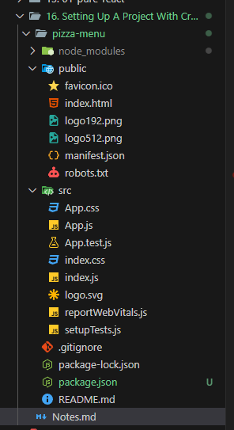

# 16. Setting Up A Project with Create-React-App

1. **Create-React-App** - This is a **Command Line Interface** tool
2. Navigate to the directory where you want to create your React App
> npx create-react-app {your name of the application}  
> Example - npx create-react-app pizza menu 
3. If suppose say i want to use a specific version of react 
> npx create-react-app@{version number} {your name of the application}    
> Example - npx create-react-app@5 pizza menu
> This will lock in version 5 of the react application
4. Once after the react application is created  
  1.1. We have **package.json** - which contains 
    * The name of the Application
    * Version
    * Dependency Scripts
5. **node_modules** - This contains all the packages that are required for our application to run. This has the
  * React package
  * React DOM package
6. The CLI Command has actually created the **index.html** and **index.js** for us   
  
Also if we open **index.js**
```jsx
// As we can see below it already selects the root element, then uses the createRoot method from the ReactDOM library
// The below part takes care of rendering the <App /> component into the DOM
const root = ReactDOM.createRoot(document.getElementById('root'));
root.render(
  <React.StrictMode>
    <App />
  </React.StrictMode>
);
```  
7. Our application will run successfully on **localhost 3000**    
8. Now we will modify our **App.js** in order to print **Hello React** on the screen  
```JSX
import './App.css';

function App() {
  return (
    <h1>Hello React!!!</h1>
  );
}

export default App;
```
